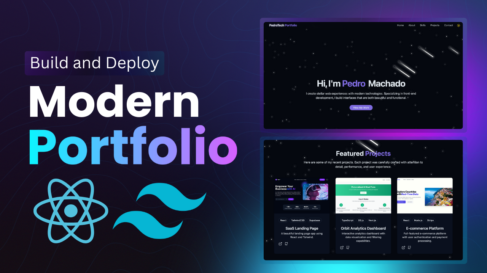

# Beautiful Portfolio Website

<div align="center">
  
  <br />
  <br />
  <div>
    
    
    
    
    
  </div>
  <h3 align="center">A Modern Full-Stack Developer Portfolio</h3>
</div>

## 📋 Table of Contents

1. [Introduction](#-introduction)
2. [Tech Stack](#-tech-stack)
3. [Features](#-features)
4. [Project Structure](#-project-structure)
5. [Getting Started](#-getting-started)
6. [Environment Variables](#-environment-variables)
7. [API Endpoints](#-api-endpoints)

---

## 🚀 Introduction

This is a modern, responsive portfolio website built with **React** and **TailwindCSS**, powered by a **Node.js/Express** backend. It features a stunning UI with dark mode support, animated backgrounds, and a seamless project showcase. The backend handles contact form submissions and includes an AI chat integration.

---

## ⚙️ Tech Stack

### Frontend
* **React** – Component-based UI library
* **Vite** – Next Generation Frontend Tooling
* **TailwindCSS** – Utility-first CSS framework
* **Lucide React** – Beautiful & consistent icons
* **Framer Motion** – Production-ready animation library

### Backend
* **Node.js** – JavaScript runtime environment
* **Express** – Fast, unopinionated, minimalist web framework
* **Google Generative AI** – For AI chat capabilities

---

## ⚡️ Features

* 🌑 **Dark/Light Mode** – System preference detection with manual toggle.
* 💫 **Animations** – Smooth transitions and interactive elements.
* 📱 **Fully Responsive** – Optimized for mobile, tablet, and desktop views.
* � **Contact Form** – Functional contact form connected to the backend.
* 🤖 **AI Chat** – Integrated AI chatbot for visitor interaction.
* 🖼️ **Project Showcase** – Dedicated section to display your work.

---

## 📂 Project Structure

```
portfolio/
├── backend/                # Node.js/Express Backend
│   ├── controllers/        # Request handlers
│   ├── routes/             # API routes (ai, contact)
│   ├── services/           # Business logic
│   └── server.js           # Entry point
├── src/                    # React Frontend
│   ├── components/         # Reusable UI components
│   ├── pages/              # Main application pages
│   ├── assets/             # Static assets
│   └── App.jsx             # Root component
├── public/                 # Public static files
└── index.html              # HTML entry point
```

---

## �️ Getting Started

Follow these steps to set up the project locally.

### Prerequisites

* [Node.js](https://nodejs.org/) (v16+)
* [npm](https://www.npmjs.com/)

### Installation & Running

This project consists of a **Frontend** and a **Backend**. You need to run them in separate terminals.

#### 1. Backend Setup

Open a terminal and navigate to the backend directory:

```bash
cd backend
npm install
node server.js
```
The backend will start at `http://localhost:5050`.

#### 2. Frontend Setup

Open a **new terminal** (keep the backend running) and navigate to the root directory:

```bash
# Verify you are in the root 'portfolio' directory
npm install
npm run dev
```
The frontend will start at `http://localhost:5173`.

---

## 🔐 Environment Variables

Create a `.env` file in the `backend/` directory if required for the AI features:

```env
# backend/.env
GEMINI_API_KEY=your_api_key_here
```

---

## � API Endpoints

### Health Check
* `GET /health` - Check if backend is running.

### AI
* `GET /api/ai/test` - Test AI route.
* `POST /api/ai/chat` - Send a prompt to the AI.

### Contact
* `POST /api/contact` - Submit contact form.

---

Made with ❤️ using React & Node.js
# portfolio
